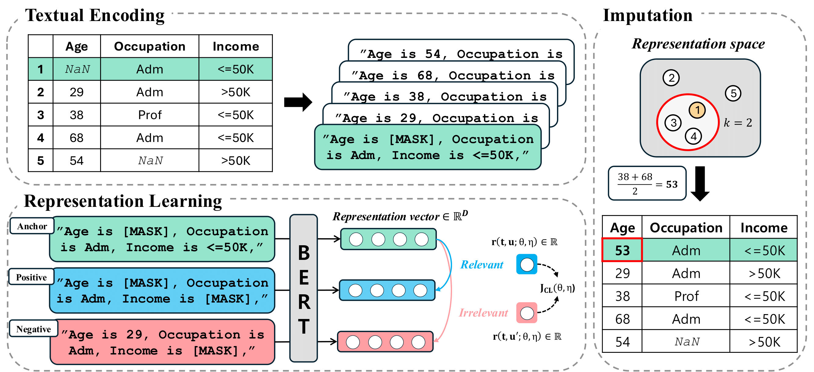

# DrIM
This repository is the official implementation of 'DrIM: Context-Driven Nearest Neighbor Imputation using Language Representation' with PyTorch.

> **_NOTE:_** This repository supports [WandB](https://wandb.ai/site) MLOps platform!

## Overview


## Dataset

Download and add the datasets into `data` folder to reproduce our experimental results.

## Reproducibility

### Arguments
- `--dataset`: dataset options (`abalone`,  `anuran`, `banknote`, `breast`, `concrete`, `kings`,  `letter`, `loan`, `redwine`, `whitewine`)
- `--missing_type`: how to generate missing (`MCAR`, `MAR`, `MNARL`, `MNARQ`)
- `--missing_rate`: missingness rate (default: `0.3`)
- `--layers`: the number of layers fine-tuned in language model (default: `3`)
- `--language_model`: Language model (default: `bert-base`), options (`bert-base`, `bert-large`, `gpt2`, `llama`, `gpt-neo`, `roberta`)
- `--K`: the number of nearest neighbors (default: `5`)

### Imputation & Evaluation 

> RQ1. ***Overall performance.*** Does DrIM demonstrate state-of-the-art performance in missing data imputation? 
```
python main.py --dataset <dataset> --missing_type <missing_type> --missing_rate <missing_rate>
```

> RQ2. ***Ablation study: Effect of contrastive learning.*** To what extent does contrastive learning contribute to the imputation performance of DrIM? 
- w/o CL
```
python main.py --dataset <dataset> --missing_type <missing_type> --missing_rate <missing_rate> --layers 0
```
- DrIM
```
python main.py --dataset <dataset> --missing_type <missing_type> --missing_rate <missing_rate> --layers 3
```

> RQ3. ***Sensitivity analysis: Missingness scenarios.*** How robust is DrIM's performance under varying missingness rates and patterns? 
```
python main.py --dataset <dataset> --missing_type <missing_type> --missing_rate <missing_rate>
```


> RQ4. ***Ablation study: Language models.*** How does DrIM perform when combined with different language models? 
```
python main.py --dataset <dataset> --missing_type <missing_type> --missing_rate <missing_rate> --language_model <language_model>
```

## Directory and codes

```
.
+-- data
+-- assets 
+-- datasets
|       +-- preprocess.py
|       +-- raw_data.py
+-- evaluation
|       +-- evaluation.py
|       +-- metrics_impute.py
|       +-- metrics_MLu.py
+-- modules 
|       +-- embedding.py
|       +-- missing.py
|       +-- model.py
|       +-- textual_encoding.py
|       +-- train.py
|       +-- utils.py
+-- main.py
+-- supp.pdf
+-- Figure.png
+-- README.md
```
